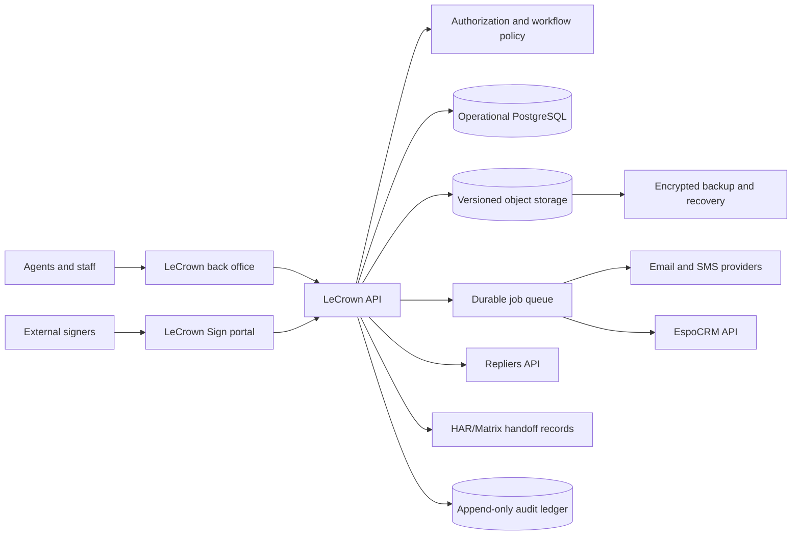

# LeCrown Properties Back-Office Execution Roadmap

## Purpose

Build an authenticated, broker-supervised operating system for LeCrown
Properties that supports the full internal lifecycle from lead intake through
representation, property search, transaction execution, closing, commission
reconciliation, and regulatory record retention.

The canonical employee-facing production URL is
`https://backoffice.lecrownproperties.com`, with browser API calls routed
same-origin under `/api/*`. External signer delivery will use the separately
gated `https://sign.lecrownproperties.com` surface when LeCrown Sign reaches an
approved deployment phase.

This roadmap includes a first-party electronic-signature capability, working
name **LeCrown Sign**. The goal is a LeCrown-owned signing workflow comparable
to the core contract preparation, routing, signing, evidence, and retention
functions commonly associated with commercial electronic-signature products.
It is not a claim of legal equivalence, certification, or feature parity with
any particular vendor.

A standalone local Signing Rooms prototype now provides interaction and PDF
generation evidence for part of this target. Its exact capabilities,
limitations, source commit, and migration mapping are recorded in the
[LeCrown Sign Prototype Handoff](./lecrown-sign-prototype-handoff.md). The
prototype is not integrated, deployed, or authorized for live signatures.

This is an execution roadmap, not evidence that any phase is implemented,
deployed, legally approved, or production-ready.

## Implementation Progress

Last updated: 2026-09-04.

The first five sprint slices now have a tested backend foundation:

- Sprint 0: system boundaries, pilot gates, risks, and unresolved decisions are
  captured here. Named operational, broker, security, and legal acceptance is
  still required; the software does not infer those owners.
- Sprint 1: an Alembic foundation revision, brokerage-scoped role evaluation,
  append-only application audit events, and environment-separated document
  configuration are implemented. PostgreSQL deployment, durable workers,
  backup/restore, and production observability remain open.
- Sprint 2: brokerage, agent profile, role assignment, and designated-broker
  foundations are implemented. Password-confirmed short-lived privileged tokens
  protect configuration mutations. Passkeys/MFA, delegation workflows, and
  license verification are not yet implemented.
- Sprint 3: authenticated PDF upload is size/type bounded, content-addressed by
  SHA-256, stored immutably, linked to brokerage/transaction records, and
  audited. Malware scanning and rendering remain explicitly `pending` until
  isolated workers are connected.
- Sprint 4: authenticated representation and transaction creation APIs and
  service tests are implemented with brokerage-scoped authorization and audit
  events. Parties, milestones, checklists, review decisions, and UI workflows
  belong to subsequent slices.

Separately, a standalone React Signing Rooms prototype at local commit
`f6441b0` demonstrates PDF upload, source hashing, ordered recipients,
electronic-record consent, typed signatures, application audit events, and an
executed PDF with appended signature and audit pages. This is reusable product
and workflow evidence only. It does not satisfy Phase 6 because its state,
tokens, signing links, events, and files are browser-local and it lacks the
server enforcement, identity, delivery, artifact sealing, custody, and recovery
controls required below.

The production-shaped delivery bundle now builds the employee app for
same-origin `/api` access at `backoffice.lecrownproperties.com`, runs Alembic
before backend startup, persists database and document data, restricts trusted
hosts, provides container health checks, and includes nginx, installation, and
public verification scripts. An isolated compose acceptance test proved the
HTML shell, `/api/healthz`, and protected back-office route schema through one
origin. DNS, TLS installation, production credentials, source publication, and
live deployment remain separate external activation states.

This progress is local implementation evidence only. It is not deployment,
broker acceptance, legal approval, or authorization for live provider data or
external contract signing.

## Current Baseline

As of 2026-08-25, the repository provides:

- a FastAPI backend and React admin application;
- local JWT authentication with active/admin user distinctions;
- invitations and password changes;
- tenant-aware content, inquiry, intake, distribution, invoice, billing, and
  government-contracting capabilities;
- an EspoCRM lead-delivery client;
- an approved Repliers/HAR licensing handoff whose live dataset still requires
  bounded validation;
- SQLite persistence and lightweight startup migrations.

The repository does not yet provide:

- brokerage roles and permissions;
- agent, client, representation, property, transaction, or commission models;
- durable document/object storage;
- document versioning or immutable evidence custody;
- platform-integrated electronic-signature envelopes or signer identity
  workflows (a separate local reference prototype exists);
- broker compliance review queues;
- transaction deadlines and checklists;
- production-grade migration, job, notification, or audit infrastructure;
- verified disaster recovery for brokerage records.

## Outcomes

The completed back office should let an authorized LeCrown user:

1. receive or create a lead and resolve duplicates;
2. assign a responsible agent and broker supervisor;
3. create a buyer, seller, landlord, or tenant representation matter;
4. search permitted Repliers/HAR records without exposing provider credentials;
5. create a transaction workspace and deadline checklist;
6. prepare an approved form or uploaded contract for signature;
7. route the document through LeCrown Sign with verified consent and evidence;
8. obtain broker review where policy requires it;
9. retain the completed agreement and evidence in the transaction record;
10. reconcile closing and commission facts; and
11. produce a complete, readily available audit and retention package.

## Product and System Boundaries

### `lecrown-platform`

Owns:

- authenticated back-office navigation and user experience;
- brokerage authorization and workflow policy;
- property-intelligence orchestration;
- representations, transactions, checklists, deadlines, and review queues;
- LeCrown Sign envelopes, evidence, and completed artifacts;
- document index, custody metadata, audit events, and retention policy;
- commission calculation and reconciliation workflow;
- reporting across platform-owned operational records;
- integration contracts and delivery status.

### EspoCRM

Owns:

- leads, contacts, accounts, opportunities, activities, and follow-ups;
- relationship history and operational communication context;
- configurable sales-pipeline views.

The platform stores stable foreign references and synchronization state. It
must not silently fork EspoCRM into a second competing contact database.

### Repliers/HAR

Owns licensed property and listing data within the approved agreement. The
platform owns a bounded, allowlisted API facade and its source/freshness
metadata. Repliers access does not authorize MLS listing entry, unrestricted
redistribution, bulk export, contract creation, or public display.

### HAR/Matrix and approved transaction systems

Remain authoritative for functions that the brokerage or MLS requires to occur
there, including MLS listing creation or maintenance and any mandated forms,
submission, or compliance workflows. The back office records the handoff and
reconciled status; it does not pretend that a Repliers search call created an
MLS listing.

### Object storage

Owns immutable document bytes, completed artifacts, and evidence packages.
Relational storage owns metadata, access policy, hashes, versions, links, and
state. Production document bytes must not be stored as unbounded database
blobs or local container files.

## Guiding Principles

1. Broker accountability is explicit in the workflow and cannot be replaced by
   an agent self-approval checkbox.
2. Every operational state must distinguish draft, requested, approved,
   delivered, signed, completed, filed, and reconciled.
3. Provider credentials and unrestricted licensed payloads remain server-side.
4. Completed documents are immutable; corrections create a new version or a
   superseding envelope.
5. Audit history is append-only from the application perspective.
6. Signing evidence proves what the system observed; it must not overstate
   identity certainty or legal validity.
7. Human approval is required for representation, contract, compliance,
   outreach, filing, trust-money, and commission actions designated by policy.
8. Accessibility, mobile usability, privacy, and signer recovery are acceptance
   requirements, not later polish.
9. Integrations use explicit APIs and delivery records, not shared folders or
   direct cross-system database writes.
10. Live data, sending, signing, deployment, and production activation are
    separately gated states.

## Target Architecture



Production should converge on deployable modules in the existing application
before considering separate services. Split LeCrown Sign into an independently
deployed service only when security isolation, scale, or operational ownership
requires it. Maintain a separate schema/module boundary from the start.

## Roles and Authorization

Replace `is_admin` as the only authorization distinction with scoped roles and
permissions. Administrative status may remain for platform administration but
must not implicitly grant every brokerage or signing action.

| Role | Primary authority | Explicit restrictions |
|---|---|---|
| Platform administrator | Users, integrations, environments, system health | Cannot approve brokerage work solely because of platform role |
| Designated broker | Brokerage policy, supervision, final compliance access | High-risk actions require reauthentication and audit reason |
| Delegated supervisor | Assigned agent and transaction reviews | Limited to written delegation scope and effective dates |
| Transaction coordinator | Checklists, deadlines, document preparation | Cannot impersonate signers or approve broker-only gates |
| Agent | Assigned clients, searches, transactions, document preparation | Cannot view unrelated matters or self-approve restricted steps |
| Compliance reviewer | Review queues, exceptions, retention packages | Read access must remain purpose- and matter-scoped |
| Finance user | Commission and disbursement reconciliation | No automatic authority over contract terms or signatures |
| Read-only auditor | Exportable evidence and activity history | No mutation, resend, void, or download beyond granted scope |
| External signer | Assigned envelope and own signing actions | No general back-office access or other recipients' private fields |

Implement permissions as named capabilities, including:

```text
users.manage
brokerage.configure
agents.assign
contacts.read_assigned
representations.create
representations.approve
transactions.create
transactions.review
documents.prepare
documents.download_sensitive
envelopes.prepare
envelopes.send
envelopes.void
envelopes.audit
compliance.approve
commissions.prepare
commissions.approve
reports.export
integrations.configure
```

Every permission check must also enforce organization, business unit, matter,
assignment, and record-state constraints.

## Canonical Domain Model

Use UUID identifiers, UTC timestamps, explicit status fields, optimistic
concurrency/version columns, and soft deletion only where policy permits.
Completed evidence records cannot be soft-deleted through ordinary product
flows.

### Organization and people

- `Brokerage`: legal name, license identity, designated broker, policy version.
- `Office`: brokerage location and jurisdiction context.
- `Team`: operational grouping and delegated supervisor.
- `AgentProfile`: platform user, license facts, sponsorship, status, authority.
- `SupervisorDelegation`: supervisor, agent/team scope, start/end, written proof.
- `Party`: minimum platform-owned identity reference for transaction use.
- `CRMReference`: EspoCRM entity type/id, sync version, status, last result.
- `RoleAssignment`: role, scope, effective dates, grantor, revocation.

### Brokerage work

- `Representation`: client role, agent, brokerage, effective/expiration dates,
  agreement and disclosure references, status.
- `PropertyReference`: provider identifiers, normalized address, source,
  retrieval timestamps, license scope; not a full MLS mirror.
- `Transaction`: purchase, sale, lease, or management matter with responsible
  parties, property, lifecycle, broker, and confidentiality classification.
- `TransactionParty`: party role, representation side, contact/CRM reference.
- `Offer`: versioned commercial facts and source document references.
- `Milestone`: option, financing, inspection, closing, possession, and custom
  deadlines with source clause and responsible person.
- `ChecklistTemplate` and `ChecklistItem`: policy-versioned operational gates.
- `ReviewRequest`: broker/compliance decision, reason, evidence, disposition.
- `Activity`: material note, call, meeting, delivery, or external-system event.

### Documents

- `Document`: logical record, classification, owner matter, retention rule.
- `DocumentVersion`: immutable bytes reference, SHA-256, MIME type, size,
  uploader, scan result, and created time.
- `DocumentRelationship`: representation, transaction, offer, commission, or
  envelope association.
- `DocumentAccessGrant`: subject, scope, purpose, expiration, revocation.
- `RetentionPolicy`: trigger, duration, legal hold behavior, disposition.
- `LegalHold`: scope, reason, authority, start/release audit.

### LeCrown Sign

- `SigningTemplate`: approved document version, role schema, field schema,
  policy and approval version.
- `Envelope`: owning matter, source document version, sender, status, expiration,
  delivery policy, and final artifact references.
- `Recipient`: role, routing order, identity method, delivery target, status.
- `SigningField`: document page/coordinates, semantic type, recipient, required
  state, validation, and stable field identifier.
- `RecipientSession`: short-lived session, challenge, authentication evidence,
  risk result, timestamps, revocation.
- `ConsentRecord`: disclosure version, presentation, acceptance, access test,
  withdrawal method, and timestamp.
- `SignatureAdoption`: typed, drawn, or uploaded mark metadata and explicit
  intent statement; image bytes alone are not the evidence.
- `EnvelopeEvent`: append-only actor/action/time/context record.
- `ArtifactHash`: algorithm, digest, document version, and creation context.
- `CompletionCertificate`: human-readable summary plus machine-verifiable
  manifest of document, recipients, events, hashes, and system seal.
- `DeliveryAttempt`: provider message ID, target, attempt, delivery result,
  bounce/failure, and timestamps.
- `WebhookSubscription` and `WebhookDelivery`: optional downstream state
  notifications with signed delivery and replay protection.

### Finance and reporting

- `CommissionPlan`: effective-dated rules and broker approval.
- `CommissionWorksheet`: gross commission, split, referral, deductions, net,
  preparation and approval states.
- `ClosingReconciliation`: expected/actual closing facts and discrepancies.
- `DisbursementReference`: external accounting/title reference and status; it
  does not move money by itself.
- `MetricSnapshot`: reproducible report inputs and calculation version.

## LeCrown Sign Execution Specification

### Product boundary

Version 1 supports ordinary brokerage agreements and transaction documents only
after form-by-form approval. It must not initially support:

- remote online notarization;
- deeds or other recordable instruments;
- transferable records or negotiable instruments;
- wills, family-law documents, court filings, or documents excluded by law;
- biometric identity matching;
- qualified/certified signatures under foreign regimes;
- unattended agent-side signing on behalf of a client;
- modification of a completed document;
- mass-send campaigns.

Those capabilities require separate legal, security, and operational reviews.

### Envelope lifecycle

```text
draft
prepared
approval_required
approved
queued
sent
delivered
viewed
in_progress
completed
declined
voided
expired
delivery_failed
superseded
```

State transitions are server-controlled. Every transition records the prior
state, next state, actor, reason, request identifier, timestamp, and policy
version. Resend does not erase prior delivery attempts. Correcting a document
after send voids or supersedes the envelope and starts a new envelope against a
new immutable document version.

### Preparation workflow

1. Upload or select an approved source document.
2. Validate file type, size, page count, encryption state, and malware scan.
3. Calculate and store the source SHA-256 hash.
4. Assign a transaction and document classification.
5. Define recipient roles and routing order.
6. Place required signature, initial, name, date, checkbox, and text fields.
7. Validate that every required field has exactly one recipient and valid page
   coordinates.
8. Validate that every required signer has a delivery and identity policy.
9. Render a stable preview from the exact immutable source bytes.
10. Run a preflight report for missing roles, fields, dates, disclosures,
    broker approval, and unsupported document types.
11. Require sender confirmation and step-up authentication before send.

Template edits create new template versions. Existing envelopes remain bound to
the versions used at creation.

### Delivery and access

- Generate a single-use, high-entropy invitation token and store only its hash.
- Do not place document content, names, transaction facts, or provider secrets
  in URLs.
- Bind the invitation to recipient, envelope, expiry, and allowed attempts.
- Use short-lived, rotating signing sessions after invitation redemption.
- Rate-limit by token, account, recipient, IP risk signal, and device session.
- Detect replay, enumeration, impossible state transitions, and excessive
  challenge failures.
- Record delivery separately from email acceptance, link opening, identity
  verification, document viewing, and signing.
- Support accessible browser signing without requiring account creation when
  policy allows it.

Email-link possession is delivery evidence, not strong identity proof. Select a
risk-based identity policy per document type and signer role:

| Tier | Candidate controls | Intended use |
|---|---|---|
| Basic | Invitation link, explicit consent, session/device evidence | Low-risk forms only after legal approval |
| Standard | Invitation plus independent one-time challenge and recipient facts already held by the brokerage | Ordinary approved contracts |
| Strong | Account or verified enrollment plus phishing-resistant MFA such as WebAuthn/passkey | Agents, staff, broker approvals, elevated-risk signers |
| Escalated | Manual identity review or approved identity-proofing provider | Exceptions selected by policy/legal review |

Do not use public-record knowledge questions as the sole proof of identity. Do
not represent IP address, device fingerprint, email access, or SMS possession as
proof of a person's legal identity.

### Consent and intent

Before exposing signing controls, present the applicable electronic-record
disclosure and capture:

- affirmative agreement to conduct the transaction electronically;
- the documents or categories covered by the consent;
- hardware/software and access requirements;
- how to obtain paper copies and whether fees apply;
- how to withdraw consent and the consequences of withdrawal;
- how to update contact information;
- evidence that the signer could access the electronic record format;
- disclosure version, locale, presentation timestamp, and acceptance timestamp.

At the signing action, show the exact intent statement and require a deliberate
action such as **Adopt and sign**. Record the document hash, field identifiers,
recipient session, authentication result, and intent text version. A typed or
drawn mark is presentation; the evidence package establishes its association
with the person, document, and intent event.

### Document finalization

Finalization must be idempotent and run in a single controlled workflow:

1. Verify all required recipients and fields are complete.
2. Freeze the ordered event set used for completion.
3. Render the final PDF from the immutable source and accepted field values.
4. Add visible signature/initial/date appearances without obscuring source text.
5. Calculate the completed-document SHA-256 hash.
6. Generate a completion certificate and JSON evidence manifest.
7. Apply a LeCrown platform integrity seal using a protected signing key.
8. Store the source, completed PDF, certificate, and manifest as immutable
   versions.
9. Write completion events and artifact references atomically;
10. deliver completed copies according to policy;
11. link the completed package to the representation or transaction record;
12. schedule retention and backup verification.

The platform seal attests to artifact integrity and system processing. It must
not be described as the external signer's personal digital certificate unless
the signer actually controlled a qualifying signing credential.

### Completion certificate

The certificate must include:

- envelope and transaction-safe reference identifiers;
- source and completed document hashes and algorithms;
- document name, version, page count, and completion time;
- each recipient's role, routing order, and terminal status;
- delivery, view, consent, authentication, signature, decline, and completion
  timestamps as applicable;
- authentication method and result without exposing secrets;
- disclosure and policy versions;
- event-log digest and integrity-seal metadata;
- sender, approving broker/reviewer, and finalization service identity;
- timezone display plus canonical UTC timestamps;
- verification instructions and support/redress contact.

The downloadable audit certificate should omit unnecessary raw IP/device data.
More sensitive evidence may remain in restricted audit storage and be disclosed
only under policy, investigation, or legal process.

### Evidence and tamper resistance

- Hash every source, intermediate approved representation, completed artifact,
  certificate, and manifest with SHA-256 or a reviewed successor.
- Store an append-only event stream; corrections append compensating events.
- Include stable event IDs, sequence numbers, server times, request IDs, actor
  types, and integrity linkage.
- Use a KMS/HSM-backed asymmetric key for platform seals in production.
- Record key ID and certificate/version, never private-key material.
- Rotate keys without invalidating verification of historical artifacts.
- Maintain independent, encrypted backups and periodic restore evidence.
- Enable object versioning and retention lock after retention/legal review.
- Synchronize production clocks and alert on unacceptable drift.
- Provide an offline verifier that can validate package hashes and the platform
  seal without database access.

### Security controls

- Migrate production operations from SQLite to PostgreSQL with reviewed schema
  migrations and transaction semantics.
- Encrypt data in transit and at rest; encrypt especially sensitive fields at
  application or storage-key scope where warranted.
- Use malware scanning and safe PDF parsing/rendering in an isolated worker.
- Block active content, embedded files, external callbacks, and unsupported PDF
  features until reviewed.
- Use signed, short-lived object URLs after authorization; never expose bucket
  paths directly.
- Redact document content, tokens, recipient challenges, and secrets from logs.
- Require MFA and recent reauthentication for send, void, template approval,
  broker approval, retention override, and evidence export.
- Support session revocation, authenticator recovery, invitation revocation,
  recipient correction, and security-event notification.
- Protect public signing endpoints with rate limits, abuse detection, CSRF where
  applicable, strict content security policy, and dependency scanning.
- Conduct threat modeling and independent penetration testing before external
  production signing.

### Legal and regulatory gates

Product and engineering requirements must be reviewed against, at minimum:

- the federal [E-SIGN Act, 15 U.S.C. Chapter 96](https://uscode.house.gov/view.xhtml?edition=prelim&num=0&req=granuleid%3AUSC-prelim-title15-chapter96-front),
  including validity, consumer consent, retention, and exceptions;
- the [Texas Uniform Electronic Transactions Act, Business & Commerce Code Chapter 322](https://statutes.capitol.texas.gov/Docs/BC/pdf/BC.322.pdf),
  including agreement to transact electronically, attribution, notarization,
  and retention;
- current [TREC Rule 535.2](https://www.trec.texas.gov/agency-information/rules-and-laws/trec-rules)
  requirements for broker responsibility and readily available transaction
  records;
- the actual forms, MLS rules, provider agreements, retention obligations,
  privacy duties, and filing requirements applicable to each workflow.

TREC currently states that specified brokerage records must be maintained in a
readily available format for at least four years from closing, contract
termination, or the end of the transaction. The production retention matrix
must be approved by the designated broker and counsel; four years is a floor
for covered TREC records, not a universal deletion instruction.

Use [NIST SP 800-63-4](https://pages.nist.gov/800-63-4/sp800-63.html) as a
risk-based identity design reference and [W3C WebAuthn](https://www.w3.org/TR/webauthn/)
for phishing-resistant public-key authentication. Do not claim NIST
conformance or a particular assurance level until it is independently assessed.

Before enabling a document type, record:

1. document/form name and version;
2. permitted transaction and signer roles;
3. whether electronic signature is accepted;
4. required identity and consent policy;
5. broker review requirement;
6. delivery and copy requirements;
7. retention trigger and period;
8. external filing or system-of-record requirement;
9. known exceptions; and
10. approving broker/legal authority and effective date.

## Repository Implementation Map

Keep the first implementation inside the existing backend and admin application
while preserving module boundaries:

```text
backend/
  alembic/
  app/
    models/
      brokerage.py
      representation.py
      transaction.py
      document.py
      signing.py
      commission.py
      audit.py
    routes/
      brokerages.py
      representations.py
      transactions.py
      documents.py
      signing_admin.py
      signing_public.py
      commissions.py
      compliance.py
    schemas/
      brokerage.py
      representation.py
      transaction.py
      document.py
      signing.py
      commission.py
      audit.py
    services/
      authorization_service.py
      transaction_service.py
      document_service.py
      signing_service.py
      signing_evidence_service.py
      signing_verification_service.py
      notification_service.py
      retention_service.py
      commission_service.py
    workers/
      document_scan.py
      document_render.py
      signing_finalize.py
      notification_delivery.py
      retention_jobs.py
frontend/
  admin/src/
    backoffice/
    transactions/
    documents/
    signing/
    compliance/
    commissions/
  signer/src/
tests/
  fixtures/
    brokerage/
    documents/
    signing/
```

Do not place unauthenticated signer routes in the admin router. The public
signer application should be a minimal, separately built surface with its own
content-security policy and no admin code, provider keys, or unrelated business
data. Shared types may be generated from versioned API schemas, but neither UI
should import backend internals.

Introduce Alembic or an equivalent reviewed migration system before adding the
new operational tables. Do not extend the current SQLite-only startup migration
pattern into the signing evidence schema.

## API Surface

Use versioned, task-oriented APIs. Avoid arbitrary provider passthrough and
generic endpoints that allow clients to force invalid state transitions.

```text
/brokerages
/offices
/teams
/agents
/role-assignments
/representations
/properties
/property-data
/transactions
/transactions/{id}/parties
/transactions/{id}/milestones
/transactions/{id}/checklists
/transactions/{id}/reviews
/documents
/document-versions
/sign/templates
/sign/envelopes
/sign/envelopes/{id}/recipients
/sign/envelopes/{id}/fields
/sign/envelopes/{id}/preflight
/sign/envelopes/{id}/approve
/sign/envelopes/{id}/send
/sign/envelopes/{id}/void
/sign/invitations/{token}/redeem
/sign/sessions/{id}/consent
/sign/sessions/{id}/fields
/sign/sessions/{id}/complete
/sign/envelopes/{id}/artifacts
/sign/envelopes/{id}/events
/sign/verify/{package_id}
/commissions
/closing-reconciliations
/compliance/reviews
/reports
/audit-events
```

Use idempotency keys for send, finalize, external delivery, CRM synchronization,
and webhook processing. Use ETags or version values for concurrent preparation.
External signer responses must never include other recipients' private values
or unrestricted transaction data.

## Delivery Workstreams

### Workstream A: Platform foundation

- PostgreSQL and migration tooling;
- production authentication, MFA/passkeys, session and recovery controls;
- organization-scoped RBAC and policy evaluation;
- durable job queue, retries, dead-letter handling, and idempotency;
- object storage, malware scanning, document rendering, and backup;
- append-only audit service and audit viewer;
- notification templates, delivery adapters, and status reconciliation;
- secrets management, environment separation, and observability.

### Workstream B: Brokerage operations

- brokerage, office, team, agent, license, and delegation records;
- representations and parties;
- transaction workspace, milestones, checklists, and reviews;
- document index and retention;
- broker/compliance queues and exception management;
- commission worksheets and closing reconciliation.

### Workstream C: Property intelligence

- Repliers status and bounded provider adapter;
- structured HAR search after dataset validation;
- saved searches, favorites, freshness, and provenance;
- property-to-client matching and deterministic signals;
- CMA support with source and limitation labels;
- MLS handoff and reconciliation records.

### Workstream D: LeCrown Sign

- templates and preparation UI;
- recipients, routing, fields, and preflight;
- secure invitations, signing sessions, consent, and intent;
- finalization, platform seal, certificate, and verifier;
- delivery/retry, decline, void, expiry, correction, and supersession;
- evidence export, retention, legal hold, and disaster recovery.

### Workstream E: Integration and reporting

- EspoCRM identity/reference reconciliation;
- approved form-library ingestion;
- HAR/Matrix and transaction-system handoff tracking;
- accounting export after finance approval;
- operational dashboards, compliance reporting, and audit export;
- webhook/API contract for authorized downstream consumers.

## Phased Execution

Each phase ends with demonstrable evidence. A completed phase does not
automatically authorize the next phase's external calls, sends, or deployment.

### Phase 0: Governance and architecture baseline

Deliverables:

- designated product owner, designated broker approver, security owner, and
  transaction-operations owner;
- authoritative brokerage identity and initial staff/agent roster;
- approved system-boundary and data-classification decisions;
- initial document/form inventory and no-go list;
- retention and legal-review backlog;
- threat model for back office and signing portal;
- architecture decision records for database, object storage, queue, email/SMS,
  KMS, and deployment environments;
- reconciled ownership of existing dirty/uncommitted Repliers work.

Exit criteria:

- owners accept the boundaries;
- no production credentials are committed;
- first pilot transaction/document types are named;
- legal and broker approval gates are assigned, not assumed.

### Phase 1: Production-capable platform foundation

Deliverables:

- reviewed PostgreSQL migrations and rollback/restore procedure;
- organization-scoped role and permission model;
- MFA/passkey enrollment for staff and step-up authentication;
- durable audit events with actor, scope, action, state, and request context;
- object-storage abstraction with versioning and scan status;
- background jobs, idempotency, retry policy, and dead-letter visibility;
- environment-separated configuration and secret injection;
- health, metrics, structured redacted logs, alerting, and backup jobs.

Exit criteria:

- cross-organization and cross-matter authorization tests fail closed;
- backup restore succeeds in a non-production environment;
- secrets and document contents do not appear in client bundles or logs;
- privileged actions require recent authentication.

### Phase 2: Brokerage identity and supervision

Deliverables:

- brokerage, office, team, agent, role, and delegation models;
- admin workflows for assignment, suspension, revocation, and expiry;
- license/sponsorship verification fields with evidence timestamps;
- designated broker and delegated-supervisor dashboards;
- policy-version acknowledgement and training/authority evidence hooks.

Exit criteria:

- an agent's authority can be answered for a historical date;
- deactivated or expired assignments immediately lose access;
- broker responsibility and delegation are visible and auditable.

### Phase 3: CRM, representations, and client intake

Deliverables:

- deduplicated lead intake and EspoCRM reference reconciliation;
- agent assignment and response SLA tracking;
- contact/account/opportunity mapping contract;
- representation matters for buyer, seller, landlord, and tenant roles;
- disclosure delivery tracking, including IABS where applicable;
- activity and follow-up timeline;
- explicit consent and communication-preference fields.

Exit criteria:

- one intake path reaches EspoCRM exactly once under retry;
- the platform shows CRM delivery evidence rather than inferred success;
- a representation cannot become active without required approvals/evidence.

### Phase 4: Property intelligence

Follow the separate Repliers/HAR handoff, then deliver:

- synthetic authenticated property workspace;
- secure provider adapter and controlled mock tests;
- separately authorized one-result HAR validation;
- allowlisted, source-labelled internal HAR search;
- saved searches and favorites that store definitions/references, not an
  unrestricted provider mirror;
- deterministic match/signal review;
- property references linked to representations and transactions.

Exit criteria:

- dataset identity is proven for live records;
- every result shows provider, dataset, freshness, and license scope;
- public access, bulk export, and autonomous outreach remain disabled.

### Phase 5: Transaction workspace

Deliverables:

- transaction, party, property, offer, milestone, and checklist models;
- policy-versioned checklists by transaction type;
- source-clause links for calculated deadlines;
- responsible person, escalation, completion evidence, and exception reason;
- broker/compliance review requests and decisions;
- document index with immutable versions and classification;
- HAR/Matrix and external transaction-system handoff records.

Exit criteria:

- a synthetic transaction can move through every state with full audit history;
- missed/changed deadlines are visible and never silently overwritten;
- only authorized roles can approve restricted transitions.

### Phase 6: LeCrown Sign internal sandbox

Scope: synthetic documents and LeCrown-controlled test users only.

Deliverables:

- template/version, envelope, recipient, field, and event models;
- preparation UI with PDF preview and preflight;
- secure invitation and signing-session implementation;
- consent, signature adoption, field completion, and decline flows;
- deterministic final PDF and evidence-package generation;
- platform integrity seal and offline package verifier;
- void, expire, resend, correct-recipient, and supersede operations;
- accessibility and mobile signing tests.

Exit criteria:

- source and final hashes reproduce;
- any byte change causes verification failure;
- retries cannot duplicate a send or finalization;
- a recipient cannot access another recipient's fields;
- completed artifacts cannot be edited through product or API flows;
- all tests use synthetic documents and recipients.

### Phase 7: Controlled internal agreement pilot

Scope: a low-risk, counsel/broker-approved internal document type.

Deliverables:

- approved disclosure and consent language;
- production email delivery and bounce reconciliation;
- staff passkey/MFA enforcement;
- operational support, identity recovery, void, and redress runbooks;
- completion-certificate review by broker, security, and counsel;
- backup restore and evidence-export exercise;
- limited pilot metrics and incident review.

Exit criteria:

- every pilot envelope has a verified evidence package;
- support can resolve delivery and identity exceptions without impersonation;
- legal/broker/security owners sign the phase acceptance record.

### Phase 8: External brokerage signing pilot

Scope: one approved brokerage document type, limited agents and transactions,
explicit participant consent, and manual broker oversight.

Deliverables:

- external signer identity tiers and escalation paths;
- recipient correction and paper/alternate-process handling;
- participant copy delivery and access support;
- transaction linking and four-year-or-approved retention schedule;
- production monitoring, anomaly alerts, and incident response;
- independent application security review and penetration test;
- documented rollback to an approved external signing process.

Exit criteria:

- bounded pilot completes without unresolved evidence or custody defects;
- broker review confirms readily available records;
- counsel approves expansion document-by-document;
- penetration-test critical/high findings are resolved or formally accepted by
  the accountable security owner.

### Phase 9: Compliance, retention, and broker operations

Deliverables:

- form/version approval registry;
- broker review queues and SLA/escalation rules;
- missing-document and inconsistent-state detection;
- retention matrix, legal holds, export, and controlled disposition workflow;
- TREC-ready transaction package generation;
- advertising and communication approval hooks;
- audit reports for access, signing, overrides, voids, and exports.

Exit criteria:

- a sampled closed transaction produces the required record package;
- legal hold blocks disposition;
- disposition requires authorization and leaves non-content audit evidence;
- supervisory dashboards surface overdue reviews and policy exceptions.

### Phase 10: Commissions, closing, and management reporting

Deliverables:

- effective-dated commission plans and referral terms;
- prepare/review/approve commission worksheets;
- closing statement and expected/actual reconciliation;
- discrepancy workflow and accounting export;
- agent, pipeline, volume, closing, commission, and compliance dashboards;
- metric definitions with source, calculation version, and freshness.

Exit criteria:

- calculations reproduce from versioned inputs;
- preparer and approver separation is enforced;
- payment/disbursement state is reconciled from evidence, not inferred from an
  export or button click.

### Phase 11: Scale and integration expansion

Deliverables:

- additional approved forms and transaction types;
- client portal for document copies, milestones, and controlled messaging;
- approved MLS/transaction/accounting integrations;
- webhook subscriptions with signed delivery and replay protection;
- capacity testing, multi-region recovery decision, and service-level targets;
- privacy, security, accessibility, and legal reassessment cadence.

Exit criteria:

- expansion does not weaken field policy, evidence integrity, or broker review;
- recovery objectives are tested under production-like load;
- each new integration has an owner, contract, failure mode, and reconciliation
  path.

## Initial Sprint Sequence

This is an order of execution, not a calendar commitment. Complete discovery
and acceptance for each sprint before pulling later work forward.

| Sprint | Deliverable slice | Demonstration |
|---|---|---|
| 0 | Owners, boundaries, pilot document, threat model | Signed-off decision and risk register |
| 1 | PostgreSQL migrations, organization scope, audit core | Cross-scope access denied and audited |
| 2 | Roles, assignments, MFA/passkey, privileged reauth | Agent, supervisor, and broker permissions demonstrated |
| 3 | Object storage, scan/render worker, document versions | Upload, scan, hash, preview, and immutable version |
| 4 | Representation and transaction skeleton | Lead/party to assigned transaction workspace |
| 5 | Milestones, checklists, reviews, exceptions | Broker-visible synthetic transaction workflow |
| 6 | Repliers workspace and controlled adapter | Synthetic UI; separately gated bounded HAR validation |
| 7 | Signing templates, envelopes, recipients, fields | Prepared synthetic envelope passes preflight |
| 8 | Invitations, sessions, consent, signing | Two-recipient routed signing on synthetic PDF |
| 9 | Final PDF, certificate, seal, verifier | Tamper test fails; valid package verifies offline |
| 10 | Resend, decline, void, expiry, supersession | Every terminal and recovery path audited |
| 11 | Internal approved pilot and restore exercise | Completed evidence exported after backup restore |
| 12 | Limited external pilot controls | Broker-reviewed participant signing run |
| 13 | Retention, legal hold, TREC package | Closed synthetic matter exported and held |
| 14 | Commission worksheet and reconciliation | Dual-approved reproducible closing calculation |

## Testing and Verification

### Automated tests

- model invariants and state-machine transitions;
- permission matrices and cross-scope denial;
- idempotency, concurrency, replay, and duplicate-delivery tests;
- property-based tests for field validation and envelope routing;
- deterministic PDF/hash/certificate fixtures;
- parser/render tests against malformed and hostile PDFs;
- time, expiry, timezone, deadline, and clock-skew cases;
- provider timeout, rate-limit, partial failure, and retry behavior;
- webhook signature and replay protection;
- retention and legal-hold enforcement;
- commission calculation versioning and rounding.

### End-to-end tests

- intake to EspoCRM delivery and reconciliation;
- representation to property reference to transaction;
- prepared envelope through multi-party routing and completion;
- decline, resend, correction, void, expiration, and supersession;
- broker review and compliance exception resolution;
- completed package download and offline verification;
- backup restore followed by artifact and audit verification;
- responsive and accessible signing on supported browsers/devices.

### Security verification

- threat-model review at phases 1, 6, and 8;
- dependency, static, dynamic, and secret scanning;
- authorization-focused code review;
- object access and signed-URL tests;
- log/redaction inspection;
- abuse/rate-limit and enumeration testing;
- key rotation and historical verification test;
- independent penetration test before external signing.

### Manual operational acceptance

- designated broker reviews the full transaction and evidence package;
- transaction coordinator runs deadline and document exception scenarios;
- support resolves a lost invitation and changed email without impersonation;
- finance reconciles a commission discrepancy;
- compliance produces a regulator-ready package from a restored environment;
- representative external signers complete mobile and accessibility scenarios.

## Environments and Release Gates

| Environment | Data | External effects | Purpose |
|---|---|---|---|
| Local | Synthetic only | Mock delivery and providers | Development and unit tests |
| Integration | Synthetic/de-identified | Sandbox providers only | Contract and workflow tests |
| Staging | Approved synthetic/pilot data | Controlled test recipients | Release and recovery acceptance |
| Production pilot | Explicitly approved limited records | Limited real sends/signing | Manual supervised pilot |
| Production | Authorized operational data | Policy-controlled | General approved use |

No environment promotion occurs solely because tests pass. Required evidence
includes migration results, security scan, backup/restore result, release notes,
open-risk review, operational runbooks, and accountable approval.

## Observability and Operating Metrics

Track counts and latency without placing document contents or unnecessary PII
in telemetry:

- active users by role and failed authorization attempts;
- transactions by state and overdue milestones;
- broker/compliance review age and exceptions;
- envelopes prepared, sent, delivered, viewed, completed, declined, voided,
  expired, and delivery-failed;
- median and tail time from send to delivery/view/completion;
- identity challenge and recovery outcomes;
- finalization failures, duplicate suppression, and verifier failures;
- document scan failures and storage/backup health;
- Repliers calls, dataset identity, errors, quota, and freshness;
- CRM delivery attempts, duplicates prevented, and reconciliation backlog;
- commission discrepancies and approval age;
- retention, legal hold, evidence export, and disposition actions.

Define alerts for unauthorized access spikes, repeated token redemption,
signature finalization failure, event-sequence gaps, hash mismatch, backup
failure, key or certificate expiry, provider identity ambiguity, and overdue
broker reviews.

## Operational Runbooks Required Before Production

- user compromise, termination, and role revocation;
- signer invitation loss, email correction, and identity escalation;
- envelope void, resend, decline, expiration, and supersession;
- document malware or rendering failure;
- hash or evidence verification failure;
- provider outage, rate limit, and ambiguous HAR dataset;
- email/SMS delivery outage and bounce handling;
- KMS/signing-key rotation or suspected compromise;
- database/object-storage restore and reconciliation;
- privacy request, legal hold, regulator request, and litigation preservation;
- security incident, breach assessment, participant notification, and redress;
- rollback to approved external signing or manual transaction procedure.

## Decisions Required Before Phase 1 Completion

1. Production identity provider and whether existing JWT auth is replaced or
   upgraded in place.
2. PostgreSQL hosting, backup owner, recovery objectives, and migration owner.
3. Object storage, retention-lock capability, region, and key ownership.
4. Queue/worker and notification providers.
5. KMS/HSM and platform-seal certificate strategy.
6. Initial approved roles, permission grants, and broker approval matrix.
7. Initial transaction types and checklist owners.
8. First internal and external pilot document types.
9. Electronic-record disclosure and alternate/paper process.
10. Signer identity tiers by document and risk.
11. Retention matrix, legal hold, disposition, and regulator-export format.
12. Whether any existing signing/form system must remain authoritative during
    or after the LeCrown Sign rollout.
13. Support hours, incident owner, and external signer redress path.
14. Independent legal and security reviewers for the external pilot gate.

## Definition of Back-Office MVP

The MVP is complete only when all of the following are demonstrated in a
production-like environment with synthetic data:

- scoped agent, coordinator, broker, compliance, finance, and admin roles;
- an intake record reconciled with EspoCRM;
- an approved representation linked to a transaction and property reference;
- source-labelled property search in the correct synthetic or validated mode;
- transaction parties, milestones, checklist, documents, and review history;
- a multi-recipient LeCrown Sign envelope prepared, approved, sent through a
  mock or sandbox provider, signed, completed, and verified;
- immutable source/final artifacts and a completion evidence package;
- broker-visible review, exception, and audit queues;
- a versioned commission worksheet with independent approval;
- a retention package exported after a tested restore;
- no public licensed-data route, provider secret, signer token, raw identity
  challenge, or unrestricted document URL exposed.

External production signing is a later gated capability, not part of the
synthetic MVP completion claim.

## Definition of Production Readiness

Production readiness requires:

- approved legal/form/consent/retention matrices;
- designated broker acceptance;
- security threat model and independent penetration test;
- accessibility and representative signer testing;
- proven backup, restore, artifact verification, and key rotation;
- monitored delivery, finalization, audit, and provider health;
- operational support and redress runbooks exercised;
- bounded pilot acceptance with no unresolved custody or evidence defects;
- explicit authorization for each live provider, document type, signer group,
  and external effect.

Passing implementation tests alone is not production authorization.
